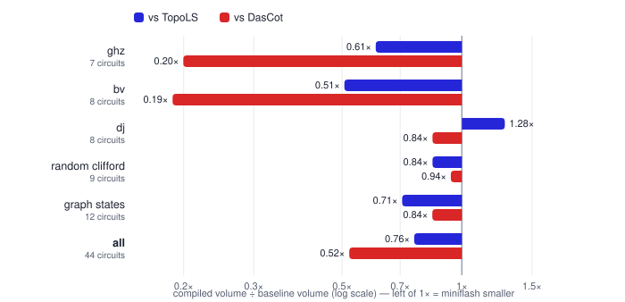
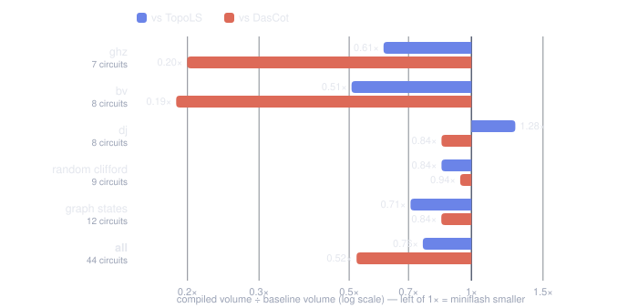

Benchmarks
==========

Compiled **spacetime volume** on 44 Clifford and graph-state circuits,
against two published lattice-surgery compilers: **TopoLS** (MCTS
search) and **DasCot** (heuristic routing). Ratios below 1× mean the
miniflash layout is smaller.

.. list-table::
   :header-rows: 1
   :widths: 24 14 20 20

   * - family
     - circuits
     - geomean vs TopoLS
     - geomean vs DasCot
   * - ghz
     - 7
     - 0.61×
     - 0.20×
   * - bv
     - 8
     - 0.51×
     - 0.19×
   * - dj
     - 8
     - 1.28×
     - 0.84×
   * - random clifford
     - 9
     - 0.84×
     - 0.94×
   * - graph states
     - 12
     - 0.71×
     - 0.84×
   * - **all**
     - **44**
     - **0.76×**
     - **0.52×**

.. note::

   **Methodology.** Volume is the tile bounding box of the compiled
   layout — the same unit in all three tools (miniflash
   ``cube_envelope``, TopoLS :math:`x \cdot y \cdot z`, DasCot
   ``space × steps``). All tools compile the identical QASM inputs
   (for DasCot, up to register renaming). TopoLS ran under a 180 s
   wall clock per circuit; misses are shown as “—”. The bv-100 TopoLS
   value comes from its fast search profile. random-clifford takes
   the best of miniflash's 1-D and die configurations per circuit.
   Measured 2026-08.

Per-circuit volumes
-------------------

.. dropdown:: ghz (7 circuits)

   .. list-table::
      :header-rows: 1
      :widths: 22 16 16 16 15 15

      * - circuit
        - miniflash
        - TopoLS
        - DasCot
        - vs TopoLS
        - vs DasCot
      * - ``ghz3``
        - 45
        - 42
        - 98
        - 1.07×
        - 0.46×
      * - ``ghz4``
        - 54
        - 81
        - 147
        - 0.67×
        - 0.37×
      * - ``ghz6``
        - 72
        - 135
        - 405
        - 0.53×
        - 0.18×
      * - ``ghz8``
        - 120
        - 135
        - 567
        - 0.89×
        - 0.21×
      * - ``ghz10``
        - 144
        - 315
        - 1,089
        - 0.46×
        - 0.13×
      * - ``ghz12``
        - 168
        - 378
        - 1,331
        - 0.44×
        - 0.13×
      * - ``ghz16``
        - 216
        - 486
        - 1,815
        - 0.44×
        - 0.12×

.. dropdown:: bv (8 circuits)

   .. list-table::
      :header-rows: 1
      :widths: 22 16 16 16 15 15

      * - circuit
        - miniflash
        - TopoLS
        - DasCot
        - vs TopoLS
        - vs DasCot
      * - ``bv-16``
        - 216
        - 648
        - 1,815
        - 0.33×
        - 0.12×
      * - ``bv-20``
        - 621
        - 1,584
        - 3,211
        - 0.39×
        - 0.19×
      * - ``bv-30``
        - 990
        - 2,295
        - 6,525
        - 0.43×
        - 0.15×
      * - ``bv-40``
        - 2,160
        - 3,402
        - 11,271
        - 0.63×
        - 0.19×
      * - ``bv-50``
        - 3,420
        - 5,103
        - 17,689
        - 0.67×
        - 0.19×
      * - ``bv-60``
        - 4,221
        - 7,533
        - 21,299
        - 0.56×
        - 0.20×
      * - ``bv-80``
        - 8,463
        - —
        - 34,839
        - —
        - 0.24×
      * - ``bv-100``
        - 12,882
        - 20,196
        - 52,371
        - 0.64×
        - 0.25×

.. dropdown:: dj (8 circuits)

   .. list-table::
      :header-rows: 1
      :widths: 22 16 16 16 15 15

      * - circuit
        - miniflash
        - TopoLS
        - DasCot
        - vs TopoLS
        - vs DasCot
      * - ``dj-16``
        - 714
        - 486
        - 567
        - 1.47×
        - 1.26×
      * - ``dj-20``
        - 1,008
        - 594
        - 1,089
        - 1.70×
        - 0.93×
      * - ``dj-30``
        - 1,488
        - 1,071
        - 1,694
        - 1.39×
        - 0.88×
      * - ``dj-40``
        - 2,580
        - 1,890
        - 3,211
        - 1.37×
        - 0.80×
      * - ``dj-50``
        - 3,498
        - 2,916
        - 4,056
        - 1.20×
        - 0.86×
      * - ``dj-60``
        - 4,158
        - 4,464
        - 6,525
        - 0.93×
        - 0.64×
      * - ``dj-80``
        - 8,568
        - 8,118
        - 11,271
        - 1.06×
        - 0.76×
      * - ``dj-100``
        - 13,230
        - 10,098
        - 17,689
        - 1.31×
        - 0.75×

.. dropdown:: random clifford (9 circuits)

   .. list-table::
      :header-rows: 1
      :widths: 22 16 16 16 15 15

      * - circuit
        - miniflash
        - TopoLS
        - DasCot
        - vs TopoLS
        - vs DasCot
      * - ``4q-cx25``
        - 54
        - 243
        - 245
        - 0.22×
        - 0.22×
      * - ``4q-cx50``
        - 54
        - 243
        - 392
        - 0.22×
        - 0.14×
      * - ``4q-cx75``
        - 54
        - 351
        - 441
        - 0.15×
        - 0.12×
      * - ``8q-cx25``
        - 180
        - 540
        - 243
        - 0.33×
        - 0.74×
      * - ``8q-cx50``
        - 1,188
        - 630
        - 567
        - 1.89×
        - 2.10×
      * - ``8q-cx75``
        - 1,404
        - 810
        - 891
        - 1.73×
        - 1.58×
      * - ``16q-cx25``
        - 1,632
        - 891
        - 605
        - 1.83×
        - 2.70×
      * - ``16q-cx50``
        - 5,292
        - 1,296
        - 968
        - 4.08×
        - 5.47×
      * - ``16q-cx75``
        - 7,104
        - 2,025
        - 1,694
        - 3.51×
        - 4.19×

.. dropdown:: graph states (12 circuits)

   .. list-table::
      :header-rows: 1
      :widths: 22 16 16 16 15 15

      * - circuit
        - miniflash
        - TopoLS
        - DasCot
        - vs TopoLS
        - vs DasCot
      * - ``gs4-chain``
        - 54
        - 162
        - 147
        - 0.33×
        - 0.37×
      * - ``gs4-ring``
        - 54
        - 189
        - 196
        - 0.29×
        - 0.28×
      * - ``gs4-dense``
        - 351
        - 243
        - 196
        - 1.44×
        - 1.79×
      * - ``gs4-complete``
        - 576
        - 297
        - 245
        - 1.94×
        - 2.35×
      * - ``gs8-ring``
        - 120
        - 360
        - 648
        - 0.33×
        - 0.19×
      * - ``gs8-linear``
        - 468
        - 360
        - 567
        - 1.30×
        - 0.83×
      * - ``gs8-grid2x4``
        - 672
        - 405
        - 324
        - 1.66×
        - 2.07×
      * - ``gs8-rand50``
        - 396
        - 1,215
        - 729
        - 0.33×
        - 0.54×
      * - ``gs8-rand75``
        - 1,008
        - 1,935
        - 891
        - 0.52×
        - 1.13×
      * - ``gs8-complete``
        - 702
        - 2,655
        - 1,053
        - 0.26×
        - 0.67×
      * - ``gs16-linear``
        - 1,452
        - —
        - 1,815
        - —
        - 0.80×
      * - ``gs16-grid``
        - 4,218
        - 1,620
        - 1,452
        - 2.60×
        - 2.90×

T-dense circuits
----------------

Galois-field multipliers are dominated by magic-state injections
(112–448 T gates). Here miniflash trails DasCot — geomean
**3.05×** in die mode
(``--die-dims 2n 1 --factory t-cultivation --factories 2``): the
residual is miniflash's per-layer fabric constant (each cell layer
plus its channel gap costs ~10 levels, against DasCot's ~1 step per
routed operation), not injection scheduling. TopoLS times out on all
of them.

.. list-table::
   :header-rows: 1
   :widths: 24 14 18 18 15

   * - circuit
     - T count
     - miniflash
     - DasCot
     - vs DasCot
   * - ``gf2e4-mult``
     - 112
     - 28,350
     - 12,463
     - 2.27×
   * - ``gf2e5-mult``
     - 175
     - 49,104
     - 16,456
     - 2.98×
   * - ``gf2e6-mult``
     - 252
     - 81,474
     - 28,899
     - 2.82×
   * - ``gf2e7-mult``
     - 343
     - 117,519
     - 34,645
     - 3.39×
   * - ``gf2e8-mult``
     - 448
     - 170,226
     - 42,081
     - 4.05×

